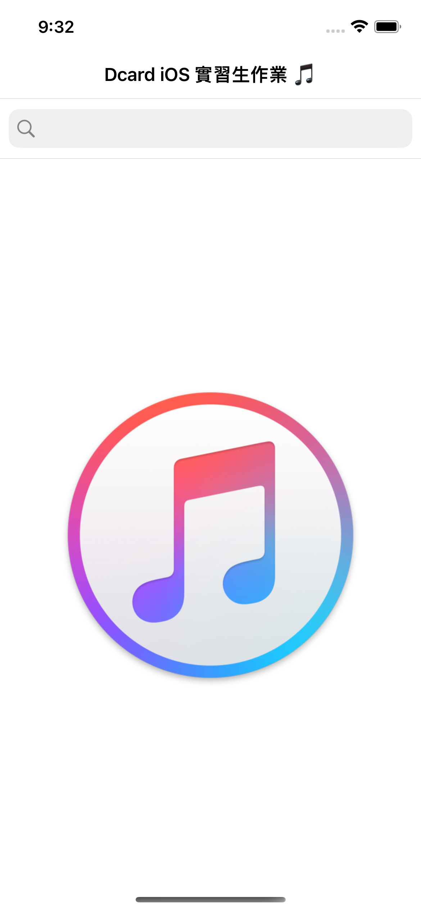
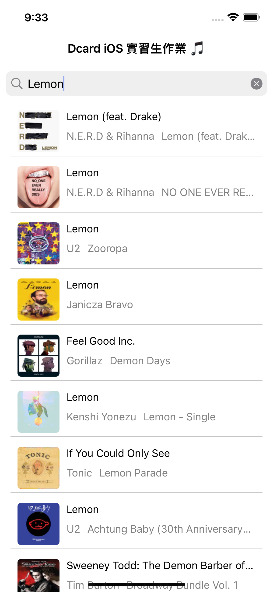
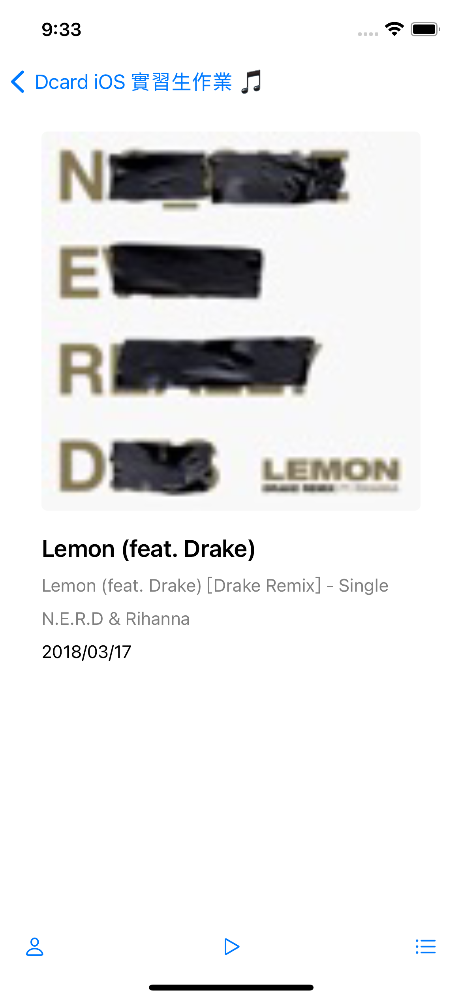

# iOS-Intern-Homework
2023 iOS Intern Homework iTunes Music App

This app is a simple music app, which can search music by keyword, show music list, show music detail and show music detail's infos preview, and it is based on MVVM architecture, use Combine to bind data between view model and view controller.

Screenshots
---------
<p float="left">
  
   
  
  
</p>

Setup Instructions
------------------
[CocoaPods](http://cocoapods.org)
```bash
cd iTunes-Music
pod install
open iTunes-Music.xcworkspace
```

Features
--------
- [x] Search music by keyword
- [x] i18n support
- [x] Show music list
- [x] Show music detail
- [x] Show music detail's infos preview
- [x] Handling of poor network conditions
- [x] Handling of empty data
- [x] Unit tests
- [ ] A11y support
- [ ] UI tests
- [ ] Using gradle to manage project dependencies
- [ ] Using bazel to build the project
- [ ] Migration to [AlomoFire](https://github.com/Alamofire/Alamofire)

Requirements
------------
- iOS 13.0+
- Xcode 13.0+
- Swift 5.0+

Infra Structure
---------------
**BaseRepository** is a generic class that provides the basic functions of the service layer, such as network request for the raw data.

**BaseDataService** is a generic class that provides the basic functions of the view model layer, it is responsible for the raw data transformation of the view model layer.

**BaseViewController** is a generic class that provides the basic functions of the view layer, such as setup subscribes and add views for the view model layer.